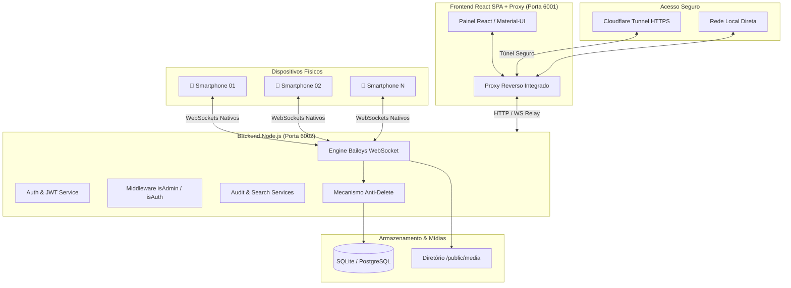

# 🛡️ GISAIO — WhatsApp Forensic Vault & Compliance Platform

<div align="center">


**Plataforma Corporativa de Auditoria Passiva, Gravação Perpétua de Mensagens e Laudos Jurídicos para WhatsApp**

</div>

---

## 📋 Índice
- [🎯 1. Visão Geral do Sistema](#-1-visão-geral-do-sistema)
- [⚡ 2. Eficiência Arquitetural: Baileys vs Puppeteer](#-2-eficiência-arquitetural-baileys-vs-puppeteer)
- [🛡️ 3. Pilares de Engenharia e Regras de Compliance](#️-3-pilares-de-engenharia-e-regras-de-compliance)
- [🔍 4. Módulo: Cofre de Auditoria Unitária](#-4-módulo-cofre-de-auditoria-unitária)
- [🧠 5. Mecanismo de Busca Telefônica Inteligente (Omnisearch)](#-5-mecanismo-de-busca-telefônica-inteligente-omnisearch)
- [🏗️ 6. Diagrama de Arquitetura do Sistema](#️-6-diagrama-de-arquitetura-do-sistema)
- [🌐 7. Especificação de Rotas & Endpoints](#-7-especificação-de-rotas--endpoints)
- [👥 8. Matriz de Perfis e Segurança (RBAC)](#-8-matriz-de-perfis-e-segurança-rbac)
- [🚀 9. Guia de Execução e Inicialização](#-9-guia-de-execução-e-inicialização)
- [📄 10. Licença & Segurança](#-10-licença--segurança)

---

## 🎯 1. Visão Geral do Sistema

O **GISAIO** é uma solução de alta performance desenvolvida para empresas e organizações que necessitam de **armazenamento forense contínuo, conformidade jurídica e auditoria transparente de múltiplos canais de WhatsApp**.

### 🌟 Destaques Principais:
* **Armazenamento 100% Imutável (Anti-Delete)**: Nenhuma mensagem ou mídia pode ser removida do banco de dados por ações externas.
* **Modo Auditor Silencioso**: Operação passiva que não altera a rotina dos operadores nem exibe robôs invasivos para os clientes.
* **Escalabilidade Massiva**: Conexão simultânea de dezenas de aparelhos com consumo mínimo de memória RAM.
* **Busca Telefônica Inteligente (Omnisearch)**: Localização instantânea de contatos considerando todas as variações de formato brasileiras (com/sem 9º dígito, com/sem DDI 55, DDD e parciais).
* **Exportação Forense**: Emissão de relatórios estruturados nos formatos **PDF**, **CSV** e **TXT** para fins comprobatórios.

---

## ⚡ 2. Eficiência Arquitetural: Baileys vs Puppeteer

Diferente de sistemas legados que instanciam navegadores Chromium completos para cada celular conectado, o GISAIO opera sobre a biblioteca **Baileys (WebSockets Puros)**:

| Característica | Puppeteer / WWebJS (Legado) | Baileys WebSockets (GISAIO) |
| :--- | :--- | :--- |
| **Tecnologia de Conexão** | 1 Navegador Chromium Headless por chip | Conexão socket TCP/TLS nativa |
| **Consumo de Memória (RAM)** | 300MB a 500MB por celular | **~25MB a 30MB por celular** |
| **Footprint para 20 Chips** | 8GB a 12GB RAM (Instável) | **~600MB RAM (Ultraleve)** |
| **Infraestrutura Necessária** | Servidor Dedicado de Alto Custo | **VPS Básica (2 vCPUs / 4GB RAM)** |
| **Resiliência de Rede** | Quedas frequentes por crash de render | **Reconexão automática silenciosa** |

---

## 🛡️ 3. Pilares de Engenharia e Regras de Compliance

### 1. 🔒 Imutabilidade Absoluta de Identidade e Nomes
* O nome atribuído pelo operador a um smartphone no pareamento (ex: `DISPOSITIVO 01`, `CENTRAL SUL - 8270`) torna-se **100% perpétuo e imutável**.
* Proibição total de renomeações em lote, resets de sessão ou sobrescrita automática por rotinas de sincronização.

### 2. 🔇 Modo "Auditor Silencioso" (Caixa Preta)
* Os atendentes utilizam os smartphones físicos ou WhatsApp Web normalmente.
* O sistema **não dispara saudações automáticas**, **não exige encerramento de tickets** e não interfere na experiência do operador ou do cliente.

### 3. 🚫 Mecanismo Anti-Delete Absoluto
* Mensagens de texto, notas de voz, fotos, comprovantes e documentos em PDF apagados no WhatsApp ("Apagar para todos") são **preservados intactos** no banco de dados e no disco.
* Destaque visual pericial: badge vermelho de auditoria `🚫 MENSAGEM APAGADA NO WHATSAPP (às HH:MM:SS)`.

### 4. ⏳ Sincronização Retroativa de Histórico
* Ao parear um novo celular via QR Code, o sistema intercepta os pacotes históricos do WhatsApp (`syncFullHistory: true`) para sincronizar retroativamente as conversas prévias.

---

## 🔍 4. Módulo: Cofre de Auditoria Unitária

O módulo de Auditoria (`/audit`) foi projetado especificamente para supervisão e auditoria forense:

```
┌─────────────────────────────────────────────────────────────────────────────────────────────┐
│ 🛡️ Auditoria   [ 🔍 Localizar número em qualquer celular (Omnisearch)... ]     [📥 Exportar] │
├─────────────────────────────────────────────────────────────────────────────────────────────┤
│ [ 📱 DISPOSITIVO 01  324 msgs ] [ 📱 CENTRAL SUL  169 msgs ] [ 📱 ATENDIMENTO 03  20 msgs ] │
├───────────────────────────────┬─────────────────────────────────────────────────────────────┤
│ 💬 Conversas do Aparelho      │ 📱 +55 (47) 9915-1766 ── DISPOSITIVO 01 ── 32 msgs          │
│ ┌───────────────────────────┐ │─────────────────────────────────────────────────────────────│
│ │ 📞 +55 (47) 9915-1766     │ │ 🕒 Timeline Contínua & Filtros Avançados                    │
│ │    NF 1.pdf               │ │ [ 🔍 Buscar termo ] [ 📅 De: dd/mm/aaaa ] [ 📅 Até: ]       │
│ ├───────────────────────────┤ │ [🔴 Apenas Apagadas] [📁 Tipo de Mídia: Todos ▾]            │
│ │ 📞 +55 (55) 9991-6869     │ │───────────────────────────────────────────────────────────│
│ │    Comprovante PIX        │ │ 👤 Cliente: Segue o comprovante em anexo.                   │
│ └───────────────────────────┘ │ 📱 Operador: Recebido com sucesso.                          │
│                               │ 🚫 [MENSAGEM APAGADA]: Valor confirmado via PIX.           │
│                               │ 🎙️ [Áudio de Voz - 0:28] ▶ 🔘━━━━━━━━━━━ 🔊                │
└───────────────────────────────┴─────────────────────────────────────────────────────────────┘
```

* **Filtro de Termos Globais**: Varredura instantânea por palavras-chave (*"PIX"*, *"acordo"*, *"comprovante"*, *"cancelamento"*, *"ameaça"*).
* **Player Nativo de Voz**: Reprodução contínua de áudios em `.ogg` e `.mp3`.
* **Exportação Pericial**: Emissão de relatórios nos formatos **PDF**, **CSV** e **TXT** formatados para fins jurídicos.

---

## 🧠 5. Mecanismo de Busca Telefônica Inteligente (Omnisearch)

O motor [`phoneSearchHelper.ts`](file:///d:/whaticket/backend/src/helpers/phoneSearchHelper.ts) implementa tolerância completa ao padrão de telefonia móvel brasileiro:


* ✅ **Busca sem o 9** (`419118`) ➡️ Encontra contatos gravados no formato 8 dígitos (`554191189892`).
* ✅ **Busca com o 9** (`4199118`) ➡️ Encontra contatos gravados no formato 8 dígitos e 9 dígitos.
* ✅ **Busca por DDD** (`479`, `4799`) ➡️ Localiza contatos de qualquer região do país.
* ✅ **Busca Formatada** (`+55 (41) 9 9118-9892`) ➡️ Higienizada e matched instantaneamente.

---

## 🏗️ 6. Diagrama de Arquitetura do Sistema



---

## 🌐 7. Especificação de Rotas & Endpoints

### Módulo de Auditoria Forense *(Requer Perfil Admin)*
| Método | Endpoint | Descrição |
| :--- | :--- | :--- |
| `GET` | `/audit/devices` | Lista os smartphones com status de conexão e volume de mensagens |
| `GET` | `/audit/devices/:id/chats` | Lista as conversas do aparelho com busca telefônica inteligente |
| `GET` | `/audit/search-all` | Busca global de contatos em **todos os aparelhos simultaneamente** |
| `GET` | `/audit/messages` | Retorna mensagens com filtros (`search`, `startDate`, `endDate`, `onlyDeleted`, `mediaType`) |
| `GET` | `/audit/export` | Gera arquivo de exportação (PDF / CSV / TXT) de uma conversa |

### Módulo Tradicional de Atendimento
| Método | Endpoint | Descrição |
| :--- | :--- | :--- |
| `GET` | `/tickets` | Listagem tradicional com filas e status |
| `POST` | `/tickets` | Criação manual de atendimento |
| `GET` | `/contacts` | Catálogo geral de contatos |
| `POST` | `/auth/login` | Autenticação e emissão de token JWT |

---

## 👥 8. Matriz de Perfis e Segurança (RBAC)

O sistema conta com controle de acesso baseado em papéis (Role-Based Access Control) rigoroso tanto na interface quanto na camada de API:

| Perfil | Cofre de Auditoria | Atendimento (Tickets) | Gestão de Conexões | Usuários & Filas |
| :--- | :---: | :---: | :---: | :---: |
| **Administrador (`admin`)** | ✅ Total | ✅ Total | ✅ Total | ✅ Total |
| **Operador (`user`)** | ❌ **Bloqueado (403)** | ✅ Apenas Atendimento | ❌ Bloqueado | ❌ Bloqueado |

---

## 🚀 9. Guia de Execução e Inicialização

### Pré-requisitos
* Node.js `>= 14.x`
* `cloudflared` (Para túnel HTTPS externo)

---

### Execução Local (Ambiente Windows):

#### 1. Iniciar o Backend (Porta 6002)
```powershell
cd d:\whaticket\backend
npm run dev
```

#### 2. Iniciar o Frontend + Proxy Integrado (Porta 6001)
```powershell
cd d:\whaticket\frontend
node server.js
```

#### 3. Abrir o Acesso Seguro Externo (Cloudflare Tunnel)
```powershell
cloudflared tunnel --url http://localhost:6001
```

---

### Deploy em Nuvem / VPS (Docker Compose):

```bash
cd d:\whaticket
docker-compose up -d --build
```

---

## 📄 10. Licença & Segurança

* Sistema desenvolvido e otimizado com foco em **Alta Performance (HPC)**, **Segurança Jurídica** e **Zero-Perda de Dados**.
* Todos os dados de mensagens, mídias e metadados pertencem 100% à infraestrutura privada da organização.
