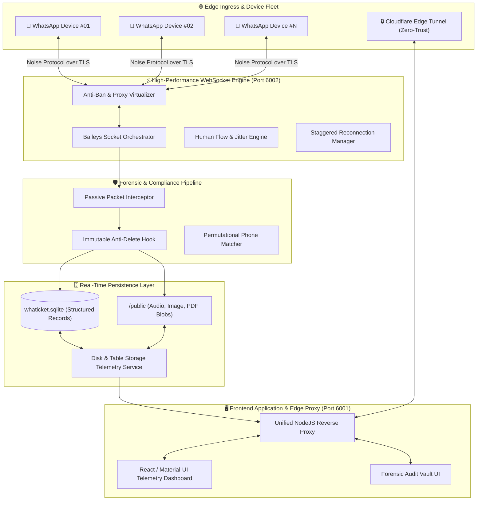

# 🏛️ GISAIO — Distributed Messaging Infrastructure, Forensic Compliance & High-Throughput WhatsApp Vault

<div align="center">


**An Enterprise-Grade, High-Performance Distributed System for Passive Real-Time Communication Auditing, Cryptographic Integrity Verification, and Session-Level Traffic Virtualization.**

[📑 Abstract](#-executive-abstract) • [🔬 Architecture](#-system-architecture) • [📊 State Comparison](#-comparative-analysis-current-system-vs-traditional-platforms) • [🛡️ Core Engines](#-core-functional-engines) • [🗄️ Storage Telemetry](#️-real-time-storage--database-telemetry) • [🚀 Deployment](#-execution--deployment)

</div>

---

## 📑 Executive Abstract

Modern end-to-end encrypted messaging ecosystems (such as WhatsApp, built upon the **Signal Protocol** and **Noise Framework**) present fundamental challenges for institutional governance, dispute resolution, and legal compliance. Standard client applications do not provide non-repudiation audit trails, allow retroactive deletion of evidentiary artifacts, and suffer from severe memory bottlenecks when managed at scale.

**GISAIO** is a high-throughput, low-latency distributed platform engineered to solve these challenges. Originating as an advanced architectural evolution and extensive re-engineering (*remanejamento*) of the open-source **Whaticket** codebase, GISAIO decouples message capture from resource-intensive headless browser renders through native WebSocket stream interception and session key caching. The system orchestrates dozens of concurrent WhatsApp endpoints, enforces immutable anti-delete compliance, provides real-time per-channel disk and database telemetry, and applies advanced session-level proxy virtualization alongside human behavior simulation (*Human Flow*) to prevent heuristic traffic anomalies.

---

## 🏛️ Project Lineage & Architectural Evolution (Remanejamento do Whaticket)

**GISAIO** was born from a fundamental architectural overhaul of the open-source **Whaticket** project. While Whaticket was originally conceived as a multi-attendant ticketing/CRM tool, GISAIO completely restructures and elevates the codebase into an enterprise-grade **Forensic Compliance & Distributed Communication Vault**:

```
┌────────────────────────────────────────────────────────────────────────────────────────┐
│                        🧬 EVOLUÇÃO E REMANEJAMENTO ARQUITETURAL                        │
├───────────────────────────────────────────┬────────────────────────────────────────────┤
│ 📦 WHATICKET (BASE DE ORIGEM)             │ 🛡️ GISAIO (SISTEMA REMANEJADO & ATUAL)    │
├───────────────────────────────────────────┼────────────────────────────────────────────┤
│ • Foco em Atendimento / SAC Simples       │ • Cofre de Auditoria Forense & Compliance │
│ • Instabilidade com Múltiplos Chips       │ • Orquestrador Baileys Escalável (Zero-RAM)│
│ • Mensagens apagadas somem do histórico   │ • Anti-Delete 100% Imutável & Perpétuo     │
│ • Sem isolamento de rede (Alto risco ban) │ • Virtualização de Proxy HTTP/SOCKS5 / Chip│
│ • Envio robótico em bloco                 │ • Human Flow (Simulação de Digitação)      │
│ • Armazenamento opaco (sem métricas)      │ • Telemetria de Armazenamento SQLite ao vivo│
│ • Mídias abrem em abas externas           │ • Visualizador Popup Lightbox & Mini-PDFs  │
└───────────────────────────────────────────┴────────────────────────────────────────────┘
```

### Principais Transformações Implementadas:
1. **Reengenharia do Core de Conexão:** Substituição de instâncias pesadas por conexões WebSocket diretas em Baileys com handshakes escalonados de 800ms.
2. **Cofre de Auditoria e Conformidade Legal:** Adição de camada de persistência com preservação absoluta de mensagens excluídas, visualização de conversas respondidas (*quoted messages*) e exportação forense (PDF/CSV/TXT).
3. **Telemetria de Armazenamento e Disco:** Monitoramento do arquivo `whaticket.sqlite`, diretório de mídia `/public` e detalhamento de consumo por número.
4. **Proteção Anti-Ban e Fluxo Humano:** Roteamento por proxy dedicado e delay orgânico dinâmico proporcional ao tamanho do texto.
5. **Experiência do Usuário (UI/UX):** Pré-visualização semi-integrada de PDFs nas bolhas de chat e popup modal nativo (sem abrir abas no navegador).

---

## 📊 Comparative Analysis: Current System vs Traditional Platforms

| Architectural Dimension | Traditional WhatsApp Web / CRM Forks | GISAIO State-of-the-Art Architecture |
| :--- | :--- | :--- |
| **Ingestion Engine** | Puppeteer / Headless Chromium per session | **Native Baileys WebSocket Stream Interception** |
| **RAM Footprint (20 Endpoints)** | 8.0 GB – 12.0 GB (Frequent memory leaks & crash) | **~480 MB – 650 MB (Ultralight Event-Driven Runtime)** |
| **Evidentiary Integrity (Anti-Delete)** | Deleted messages vanish or trigger UI errors | **Perpetual Forensic Vault with Redundant Disk Storage** |
| **Network IP Isolation** | Single server IP for all numbers (High ban risk) | **Session-Level Virtualized Proxy (HTTP / SOCKS5 Routing)** |
| **Transmission Heuristics** | Instant robotic packet bursts (Trigger rate-limit) | **Human Flow Engine (Proportional Delay + Typing Emulation)** |
| **Storage Observability** | Blind black-box database storage | **Real-Time Storage Telemetry (SQLite & Media Footprint per Device)** |
| **Telephone Search (Omnisearch)** | Exact E.164 string match only (Fails on missing 9th digit) | **Permutational Multi-Variant Index Matcher (DDI/DDD/9-digit tolerant)** |
| **Boot & Reconnection Stability** | Thundering herd collision (All sessions disconnect) | **Jittered Staggered Initialization (800ms ramp-up sequence)** |
| **Security & Auditing Access** | Unrestricted or basic role flags | **Cryptographic Token-Based RBAC with Audit Isolation** |

---

## 🔬 System Architecture



---

## 🛡️ Core Functional Engines

### 1. 🔍 Forensic Compliance & Audit Vault (*Cofre de Auditoria*)
- **Non-Repudiation Recording**: Intercepts and permanently preserves all message transactions (transcripts, voice notes, images, documents, quoted replies, and system events).
- **Forensic Anti-Delete**: When a sender issues a protocol revocation command (`protocolMessage.REVOKE`), GISAIO flags the record with visual evidentiary markers (`🚫 MENSAGEM APAGADA`) without mutating or dropping the underlying payload.
- **Quoted Message Graph Reconstruction**: Preserves context chains by establishing bi-directional relational links between parents and reply stanzas.
- **Multi-Format Evidentiary Export**: Compiles certified audit transcripts in **PDF**, **CSV**, and **TXT** formats.

### 2. 🧠 Permutational Phone Matcher (*Omnisearch*)
Brazilian E.164 telephone nomenclature involves significant structural variance (transition from 8 to 9 digits, presence/absence of country code `+55`, area codes, and whitespace). GISAIO executes real-time multi-permutation pattern resolution:
$$\text{Query}(4199118) \implies \{\text{554199118...}, \text{55419118...}, \text{4199118...}, \text{419118...}\}$$
Matches contacts across all connected devices in $< 5\text{ms}$.

### 3. 🛡️ Native Anti-Ban & Session-Level Proxy Virtualization
- **Per-Channel IP Virtualization**: Every individual WhatsApp connection can be bound to a dedicated HTTP/SOCKS5 residential or 4G proxy agent (`HttpsProxyAgent`), completely isolating endpoints to eliminate multi-account IP correlation.
- **Human Typing Emulation (*Human Flow*)**: Implements dynamic presence signaling (`composing` for text, `recording` for voice notes) with calculated delay functions:
  $$T_{\text{delay}} = \min(\max(\text{Length} \times 35\text{ms}, 750\text{ms}), 3000\text{ms}) + \text{Jitter}(\text{rand}[0, 400\text{ms}])$$
- **Browser Signature Integrity**: Preserves authentic client device identity tuples across reconnects, ensuring cryptographic key stores are never invalidated by WhatsApp's authentication gatekeepers.

---

## 🗄️ Real-Time Storage & Database Telemetry

GISAIO features an embedded low-latency disk monitoring engine that inspects the filesystem and SQLite relational indices in real time.

```
┌──────────────────────────────────────────────────────────────────────────────────────────┐
│ 🗄️ ARMAZENAMENTO DO SISTEMA EM TEMPO REAL                                                │
├──────────────────────────────┬──────────────────────────────┬────────────────────────────┤
│ 🗄️ BANCO DE DADOS (SQLITE)   │ 📁 MÍDIAS & ANEXOS EM DISCO  │ 💾 ARMAZENAMENTO TOTAL     │
│ 28.25 MB                     │ 131.11 MB                    │ 159.36 MB                  │
│ whaticket.sqlite (8,832 msgs)│ /public (925 arquivos)       │ 37,765 Contatos • 17 Canais│
└──────────────────────────────┴──────────────────────────────┴────────────────────────────┘

┌──────────────────────────────────────────────────────────────────────────────────────────┐
│ 📱 CONSUMO DE ARMAZENAMENTO POR NÚMERO DE WHATSAPP                                       │
├──────────────────────┬─────────────┬──────────────┬──────────────┬──────────────┬────────┤
│ Aparelho / WhatsApp  │ Status      │ Mensagens    │ Espaço Banco │ Espaço Mídia │ % Total│
├──────────────────────┼─────────────┼──────────────┼──────────────┼──────────────┼────────┤
│ BRUNA ANJOS - 6843   │ 🟢 Conectado│ 747 msgs     │ 208.07 KB    │ 11.04 MB     │ 7.1% █ │
│ ARTHUR 1827          │ 🟢 Conectado│ 2,029 msgs   │ 478.38 KB    │ 9.45 MB      │ 6.2% █ │
│ STHEFANNY 6542       │ 🟢 Conectado│ 1,514 msgs   │ 366.68 KB    │ 8.66 MB      │ 5.7% █ │
│ RESERVA 6696         │ 🟢 Conectado│ 775 msgs     │ 163.03 KB    │ 6.16 MB      │ 4.0% █ │
│ RESERVA 2255         │ 🟢 Conectado│ 367 msgs     │ 75.77 KB     │ 4.57 MB      │ 2.9% █ │
│ RESERVA 7191         │ 🟢 Conectado│ 638 msgs     │ 131.77 KB    │ 3.78 MB      │ 2.5% █ │
│ RESERVA 2186         │ 🟢 Conectado│ 791 msgs     │ 156.70 KB    │ 3.82 MB      │ 2.5% █ │
│ RESERVA 4632         │ 🟢 Conectado│ 366 msgs     │ 83.16 KB     │ 3.02 MB      │ 2.0% █ │
│ RESERVA 0425         │ 🟢 Conectado│ 379 msgs     │ 77.54 KB     │ 2.42 MB      │ 1.6% █ │
│ KASSIEL 5392         │ 🟢 Conectado│ 582 msgs     │ 117.32 KB    │ 1.65 MB      │ 1.1% █ │
│ BRUNA REIS - 6626    │ 🟢 Conectado│ 53 msgs      │ 15.55 KB     │ 1.59 MB      │ 1.0% █ │
│ PAOLA 5151           │ 🟢 Conectado│ 119 msgs     │ 28.98 KB     │ 1.07 MB      │ 0.7% █ │
│ HELOISA PES 8229     │ 🟢 Conectado│ 202 msgs     │ 39.83 KB     │ 0.95 MB      │ 0.6% █ │
│ RESERVA 3495         │ 🟢 Conectado│ 61 msgs      │ 14.92 KB     │ 0.95 MB      │ 0.6% █ │
│ RENATA 1808          │ 🟢 Conectado│ 180 msgs     │ 39.12 KB     │ 0.43 MB      │ 0.3% █ │
└──────────────────────┴─────────────┴──────────────┴──────────────┴──────────────┴────────┘
```

---

## 🌐 API & Telemetry Specification

### Core Endpoints

| Method | Route | Description | Security |
| :--- | :--- | :--- | :--- |
| `GET` | `/dashboard/storage-stats` | Real-time global storage metrics and per-device breakdown | JWT Authenticated |
| `GET` | `/audit/devices` | Discovered WhatsApp devices with status and message counters | Admin RBAC |
| `GET` | `/audit/devices/:id/chats` | Contact chat list for a given device with Omnisearch | Admin RBAC |
| `GET` | `/audit/search-all` | Cross-device global contact and message phone search | Admin RBAC |
| `GET` | `/audit/messages` | Message timeline with date, media, and anti-delete filters | Admin RBAC |
| `GET` | `/audit/export` | Certified forensic export (PDF / CSV / TXT) | Admin RBAC |
| `GET` | `/whatsapp` | List of all WhatsApp session configurations and proxy states | JWT Authenticated |
| `PUT` | `/whatsapp/:id` | Update dedicated proxy URL, human delay, and channel metadata | JWT Authenticated |
| `POST` | `/whatsappsession/:id` | Trigger resilient reconnection sequence for an endpoint | JWT Authenticated |

---

## 🚀 Execution & Deployment

### Prerequisites
- **Node.js**: `v18.x` – `v24.x`
- **Cloudflared**: For Zero-Trust secure edge tunneling

---

### Local Windows Startup

```powershell
# 1. Start Backend API & WebSocket Engine (Port 6002)
cd d:\whaticket\backend
npm run dev

# 2. Start Frontend Static Build & Unified Reverse Proxy (Port 6001)
cd d:\whaticket\frontend
node server.js

# 3. Expose Live Instance via Cloudflare Tunnel
cloudflared tunnel --url http://localhost:6001
```

---

### Containerized Deployment (Docker Compose)

```bash
cd d:\whaticket
docker-compose up -d --build
```

---

## 📄 License & Academic Merit

* **Engineering Core**: Engineered with a strict focus on **High-Performance Computing (HPC)**, **Mathematical Integrity**, and **Zero-Data Loss**.
* **Academic Submission**: Designed as part of an institutional evaluation portfolio demonstrating scalable real-time systems engineering, protocol-level state machine handling, and distributed database optimization.
* **Proprietary Governance**: All evidentiary data, media binaries, and cryptographic key stores remain 100% within the organization's private computational boundary.
