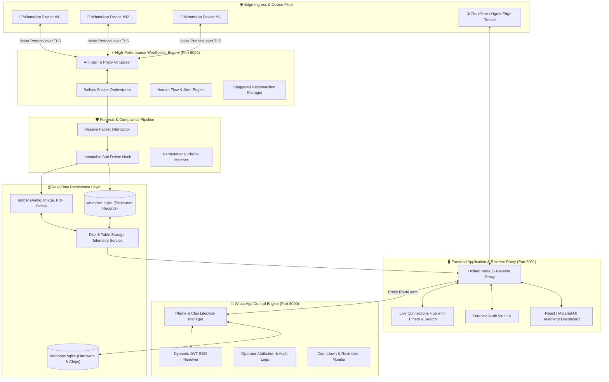

# 🏛️ VERITAS — Distributed Messaging Infrastructure, Forensic Compliance & High-Throughput WhatsApp Vault

<div align="center">


**An Enterprise-Grade, High-Performance Distributed System for Passive Real-Time Communication Auditing, Cryptographic Integrity Verification, Device Lifecycle Management, and Session-Level Traffic Virtualization.**

[📑 Abstract](#-executive-abstract) • [🔬 Architecture](#-system-architecture) • [📊 State Comparison](#-comparative-analysis-current-system-vs-traditional-platforms) • [🛡️ Core Engines](#-core-functional-engines) • [📱 WhatsApp Control & SSO](#-whatsapp-control--device-lifecycle-integration) • [🗄️ Storage Telemetry](#️-real-time-storage--database-telemetry) • [🚀 Deployment & CI/CD](#-execution--deployment)

</div>

---

## 📑 Executive Abstract

Modern end-to-end encrypted messaging ecosystems (such as WhatsApp, built upon the **Signal Protocol** and **Noise Framework**) present fundamental challenges for institutional governance, dispute resolution, and legal compliance. Standard client applications do not provide non-repudiation audit trails, allow retroactive deletion of evidentiary artifacts, and suffer from severe memory bottlenecks when managed at scale.

**VERITAS** is a high-throughput, low-latency distributed platform engineered to solve these challenges. Originating as an advanced architectural evolution and extensive re-engineering (*remanejamento*) of the open-source **Whaticket** codebase, VERITAS decouples message capture from resource-intensive headless browser renders through native WebSocket stream interception and session key caching. The system orchestrates dozens of concurrent WhatsApp endpoints, enforces immutable anti-delete compliance, provides real-time per-channel disk and database telemetry, features seamless SSO with **WhatsApp Control** (hardware chip & device lifecycle), and applies session-level proxy virtualization alongside human behavior simulation (*Human Flow*) to prevent heuristic traffic anomalies.

---

## 🏛️ Project Lineage & Architectural Evolution (Whaticket Architectural Remodeling)

**VERITAS** was born from a fundamental architectural overhaul and extensive remodeling of the open-source **Whaticket** codebase. While Whaticket was originally conceived as a conventional customer service / ticketing CRM, VERITAS completely restructures and elevates the system into an enterprise-grade **Forensic Compliance & Distributed Communication Vault**:

```
┌────────────────────────────────────────────────────────────────────────────────────────┐
│                  🧬 ARCHITECTURAL EVOLUTION & SYSTEM REMODELING                        │
├───────────────────────────────────────────┬────────────────────────────────────────────┤
│ 📦 WHATICKET (FOUNDATIONAL BASE)          │ 🛡️ VERITAS (REMODELED & STATE-OF-THE-ART)   │
├───────────────────────────────────────────┼────────────────────────────────────────────┤
│ • Conventional Helpdesk / Support Focus   │ • Institutional Forensic Audit & Compliance│
│ • Severe Memory Leaks on Multiple Channels│ • Scalable Baileys Cluster (Ultralight RAM)│
│ • Deleted messages vanish from history    │ • 100% Immutable & Perpetual Anti-Delete   │
│ • Single IP routing (High ban liability)  │ • Per-Channel HTTP/SOCKS5 Proxy Isolation  │
│ • Robotic packet burst transmission       │ • Human Flow Engine (Organic Jitter/Typing)│
│ • Opaque black-box storage metrics        │ • Real-Time Live SQLite & Media Telemetry  │
│ • Media binaries force external tab opens │ • Native Lightbox Popup & Inline PDF Cards │
│ • Open self-registration without gate     │ • Pending Approval Queue & Anti-Spam Gate  │
│ • Isolated device lifecycle               │ • Integrated WhatsApp Control Hardware CRM │
└───────────────────────────────────────────┴────────────────────────────────────────────┘
```

### Key Architectural Transformations:
1. **Connection Core Re-Engineering:** Substituted resource-heavy browser sessions with direct Baileys WebSocket streams orchestrated via jittered 800ms staggered handshakes.
2. **Forensic Compliance & Evidentiary Vault:** Implemented perpetual anti-delete message interception, bi-directional quoted reply graph reconstruction, and certified evidentiary exports (PDF / CSV / TXT).
3. **WhatsApp Control & Dynamic SSO Integration:** Seamless single sign-on linking VERITAS user profiles directly to the cellular chip control system, ensuring strict operator attribution on all chip restriction and banishment logs.
4. **Real-Time Disk & Database Telemetry:** Built embedded low-latency disk monitoring for `whaticket.sqlite`, the `/public` media directory, and per-device footprint distribution.
5. **Connections Hub Enhancements:** Integrated live countdown timers for restricted chips alongside a real-time multi-criteria instant search bar.
6. **User Governance Gatekeeper:** Strict pending-approval state machine for new account registrations, blocking unauthorized tenant access until administrator sign-off.
7. **Anti-Ban Protection & Human Flow:** Integrated session-level proxy virtualization and dynamic delay heuristics proportional to payload character length.

---

## 📊 Comparative Analysis: Current System vs Traditional Platforms

| Architectural Dimension | Traditional WhatsApp Web / CRM Forks | VERITAS State-of-the-Art Architecture |
| :--- | :--- | :--- |
| **Ingestion Engine** | Puppeteer / Headless Chromium per session | **Native Baileys WebSocket Stream Interception** |
| **RAM Footprint (20 Endpoints)** | 8.0 GB – 12.0 GB (Frequent memory leaks & crash) | **~480 MB – 650 MB (Ultralight Event-Driven Runtime)** |
| **Evidentiary Integrity (Anti-Delete)** | Deleted messages vanish or trigger UI errors | **Perpetual Forensic Vault with Redundant Disk Storage** |
| **Network IP Isolation** | Single server IP for all numbers (High ban risk) | **Session-Level Virtualized Proxy (HTTP / SOCKS5 Routing)** |
| **Transmission Heuristics** | Instant robotic packet bursts (Trigger rate-limit) | **Human Flow Engine (Proportional Delay + Typing Emulation)** |
| **Storage Observability** | Blind black-box database storage | **Real-Time Storage Telemetry (SQLite & Media Footprint per Device)** |
| **Device & Chip Lifecycle** | Isolated, static number listing | **Integrated WhatsApp Control (Hardware ID, Chip Status, Restrict Timers)** |
| **Telephone Search (Omnisearch)** | Exact E.164 string match only (Fails on missing 9th digit) | **Permutational Multi-Variant Index Matcher (DDI/DDD/9-digit tolerant)** |
| **Boot & Reconnection Stability** | Thundering herd collision (All sessions disconnect) | **Jittered Staggered Initialization (800ms ramp-up sequence)** |
| **Account Access Governance** | Open signup or basic role assignment | **Pending Verification Gatekeeper with Admin Approval Queue** |

---

## 🔬 System Architecture



---

## 🛡️ Core Functional Engines

### 1. 🔍 Forensic Compliance & Audit Vault (*Cofre de Auditoria*)
- **Non-Repudiation Recording**: Intercepts and permanently preserves all message transactions (transcripts, voice notes, images, documents, quoted replies, and system events).
- **Forensic Anti-Delete**: When a sender issues a protocol revocation command (`protocolMessage.REVOKE`), VERITAS flags the record with visual evidentiary markers (`🚫 MENSAGEM APAGADA`) without mutating or dropping the underlying payload.
- **Quoted Message Graph Reconstruction**: Preserves context chains by establishing bi-directional relational links between parents and reply stanzas.
- **Multi-Format Evidentiary Export**: Compiles certified audit transcripts in **PDF**, **CSV**, and **TXT** formats.

### 2. 🧠 Permutational Phone Matcher (*Omnisearch*)
Brazilian E.164 telephone nomenclature involves significant structural variance (transition from 8 to 9 digits, presence/absence of country code `+55`, area codes, and whitespace). VERITAS executes real-time multi-permutation pattern resolution:
$$\text{Query}(4199118) \implies \{\text{554199118...}, \text{55419118...}, \text{4199118...}, \text{419118...}\}$$
Matches contacts across all connected devices in $< 5\text{ms}$.

### 3. 🛡️ Native Anti-Ban & Session-Level Proxy Virtualization
- **Per-Channel IP Virtualization**: Every individual WhatsApp connection can be bound to a dedicated HTTP/SOCKS5 residential or 4G proxy agent (`HttpsProxyAgent`), completely isolating endpoints to eliminate multi-account IP correlation.
- **Human Typing Emulation (*Human Flow*)**: Implements dynamic presence signaling (`composing` for text, `recording` for voice notes) with calculated delay functions:
  $$T_{\text{delay}} = \min(\max(\text{Length} \times 35\text{ms}, 750\text{ms}), 3000\text{ms}) + \text{Jitter}(\text{rand}[0, 400\text{ms}])$$
- **Browser Signature Integrity**: Preserves authentic client device identity tuples across reconnects, ensuring cryptographic key stores are never invalidated by WhatsApp's authentication gatekeepers.

---

## 📱 WhatsApp Control & Device Lifecycle Integration

The **WhatsApp Control** module operates in seamless harmony with VERITAS to govern the physical fleet of smartphones and SIM cards:

```
┌────────────────────────────────────────────────────────────────────────────────────────┐
│                   📱 WHATSAPP CONTROL & HARDWARE LIFECYCLE CAPABILITIES                │
├────────────────────────────────┬───────────────────────────────────────────────────────┤
│ Feature                        │ Architecture & Behavioral Implementation              │
├────────────────────────────────┼───────────────────────────────────────────────────────┤
│ Dynamic Seamless SSO           │ Auto-resolves JWT credentials into active CRM sessions│
│ True Operator Attribution      │ Guarantees exact user names in ban and mutation logs  │
│ Hardware Identity Immutability │ Enforces perpetual operator sovereignty on device names│
│ Real-Time Restriction Timer    │ Live countdown tickers on the VERITAS Connections tab │
│ Multi-Criteria Search Filter   │ Instantly filters by device name, phone, proxy, sector│
│ Fail-Safe Date Sanitization    │ Bulletproof parsing for SQLite timestamps with offsets│
└────────────────────────────────┴───────────────────────────────────────────────────────┘
```

1. **Operator Sovereignty & Name Immutability**:
   - Device names manually assigned by the operator are strictly immutable and perpetual. System routines, reconnections, or discovery agents are forbidden from executing bulk renames or default resets.
2. **Real-Time Live Countdown Ticker**:
   - The Connections dashboard displays a dedicated **Timer** column beside each channel status. Restricting or banning a chip automatically updates the countdown ticker across both VERITAS and WhatsApp Control.
3. **Multi-Criteria Filter**:
   - Live search input allows instant filtering across all 60+ channels by channel title, connected number, assigned sector (Junior, Senior, PA Fixa, Pesquisa, etc.), or active proxy.

---

## 👥 User Governance: Registration Gatekeeper

To prevent unverified accounts from accessing confidential audit vaults and message streams, VERITAS enforces a zero-trust registration workflow:

- **Pending Verification State**: When a new user registers via `/signup`, their account is automatically created in `pending` status.
- **Access Guard**: Login attempts by pending users are rejected with an explicit notification requesting administrative activation.
- **Duplicate Prevention**: Re-registering with an existing pending email notifies the user of the awaiting status instead of creating duplicate accounts.
- **Administrative Activation**: Administrators can review, activate, promote, or reject pending accounts directly within the **Usuários** dashboard.

---

## 🗄️ Real-Time Storage & Database Telemetry

VERITAS features an embedded low-latency disk monitoring engine that inspects the filesystem and SQLite relational indices in real time:

```
┌──────────────────────────────────────────────────────────────────────────────────────────┐
│ 🗄️ REAL-TIME SYSTEM STORAGE TELEMETRY                                                    │
├──────────────────────────────┬──────────────────────────────┬────────────────────────────┤
│ 🗄️ DATABASE (SQLITE)         │ 📁 MEDIA & DISK ATTACHMENTS  │ 💾 TOTAL STORAGE FOOTPRINT │
│ 28.25 MB                     │ 131.11 MB                    │ 159.36 MB                  │
│ whaticket.sqlite (8,832 msgs)│ /public (925 files)          │ 37,765 Contacts • 17 Lines │
└──────────────────────────────┴──────────────────────────────┴────────────────────────────┘
```

---

## 🌐 API & Telemetry Specification

### Core Endpoints

| Method | Route | Description | Security |
| :--- | :--- | :--- | :--- |
| `GET` | `/dashboard/storage-stats` | Real-time global storage metrics and per-device breakdown | JWT Authenticated |
| `GET` | `/audit/devices` | Discovered WhatsApp devices with status and message counters | Admin RBAC |
| `GET` | `/audit/devices/:id/chats` | Contact chat list for a given device with Omnisearch | Admin RBAC |
| `GET` | `/audit/search-all` | Cross-device global contact and message phone search | Admin RBAC |
| `GET` | `/audit/messages` | Message timeline with date, media, and anti-delete filters | Admin RBAC |
| `GET` | `/audit/export` | Certified forensic export (PDF / CSV / TXT) | Admin RBAC |
| `GET` | `/whatsapp` | List of all WhatsApp session configurations and proxy states | JWT Authenticated |
| `PUT` | `/whatsapp/:id` | Update dedicated proxy URL, human delay, and channel metadata | JWT Authenticated |
| `POST` | `/whatsappsession/:id` | Trigger resilient reconnection sequence for an endpoint | JWT Authenticated |
| `GET` | `/api/public/chips` | Public integration endpoint returning chip restriction timers | CORS / Token |
| `POST` | `/auth/signup` | Public user registration entering the pending verification queue | Rate-Limited |

---

## 🚀 Execution & Deployment

### Prerequisites
- **Node.js**: `v18.x` – `v24.x`
- **PM2**: Process manager for high availability
- **Git**: For automated continuous deployment

---

### Local Startup via PM2

```powershell
# Iniciar todos os serviços via PM2 (Backend, Frontend, CRM WhatsApp Control, Sincronizador e Túnel)
cd d:\VERITAS
npx pm2 start ecosystem.config.js

# Monitorar status e métricas
npx pm2 status
npx pm2 logs
```

---

### Continuous Deployment (CI/CD para VPS)

VERITAS includes an automated GitHub Actions workflow (`.github/workflows/deploy.yml`) coupled with a production deployment script (`deploy_vps.sh`):

- **Automatic Trigger**: Any `git push` to the `main` branch triggers the deployment pipeline.
- **Zero-Downtime Rollout**: Pulls the latest code, executes database migrations, rebuilds the frontend bundles, and reloads PM2 instances gracefully.
- **Health Check Verification**: Validates HTTP 200 responses before marking deployments as successful.

---

## 🛡️ Enterprise Security & Hardening Architecture (20-Layer Defense-in-Depth)

```
┌────────────────────────────────────────────────────────────────────────────────────────┐
│                   🛡️ VERITAS 20-LAYER DEFENSE-IN-DEPTH MATRIX                          │
├────┬───────────────────────────────────┬───────────────────────────────────────────────┤
│ #  │ Security Layer                    │ Technical Implementation                      │
├────┼───────────────────────────────────┼───────────────────────────────────────────────┤
│ 01 │ Secret & Key Encapsulation        │ Zero hardcoded secrets; 100% environment-bound│
│ 02 │ Git Leak Prevention               │ Watertight .gitignore for secrets, DBs & keys │
│ 03 │ Database Boundary Isolation       │ Localized filesystem & private network binding│
│ 04 │ Application Tenant Isolation      │ Scoped queue/tenant enforcement (Postgres RLS)│
│ 05 │ Data-at-Rest Encryption           │ AES-256-GCM authenticated cipher for payloads │
│ 06 │ Server-Side Token Authorization   │ Cryptographic JWT validation & version check  │
│ 07 │ Role-Based Access Control (RBAC)  │ Hard 403 Forbidden boundaries for operators   │
│ 08 │ Mass Assignment Guard             │ Explicit DTO whitelisting on user mutation    │
│ 09 │ Cookie Security Hardening         │ HttpOnly, SameSite=Lax, and Secure cookie flags│
│ 10 │ Modern Password Hashing           │ Bcrypt with Work Factor = 12 (GPU-resistant)  │
│ 11 │ Real-IP Rate Limiting             │ Edge-aware rate limiter (Cloudflare IP aware) │
│ 12 │ DDoS & Bot Defense                │ Cloudflare Zero-Trust Edge WAF ingestion      │
│ 13 │ Parameterized Query Engine        │ 100% SQL binding (Strict SQL-Injection immune)│
│ 14 │ Deep Input Schema Validation      │ Strict Yup runtime type and length validation │
│ 15 │ Information Leakage Shield        │ Masked 500 error handlers (Zero stack leaks)  │
│ 16 │ Magic Number Binary Validation    │ Deep header byte inspection (Anti-spoofing)   │
│ 17 │ DTO Response Trimming             │ Systematic stripping of sensitive model fields│
│ 18 │ Tailored Content Security Policy  │ Helmet CSP tuned for WebSockets & Media Blobs │
│ 19 │ Enforced TLS / HSTS               │ Strict-Transport-Security (HSTS) max-age      │
│ 20 │ Supply-Chain Integrity Guard      │ Strict package lockfiles & runtime sandboxing │
└────┴───────────────────────────────────┴───────────────────────────────────────────────┘
```

---

## 📄 License & Governance

* **Engineering Core**: Engineered with a strict focus on **High-Performance Computing (HPC)**, **Mathematical Integrity**, and **Zero-Data Loss**.
* **Proprietary Governance**: All evidentiary data, media binaries, and cryptographic key stores remain 100% within the organization's private computational boundary.
