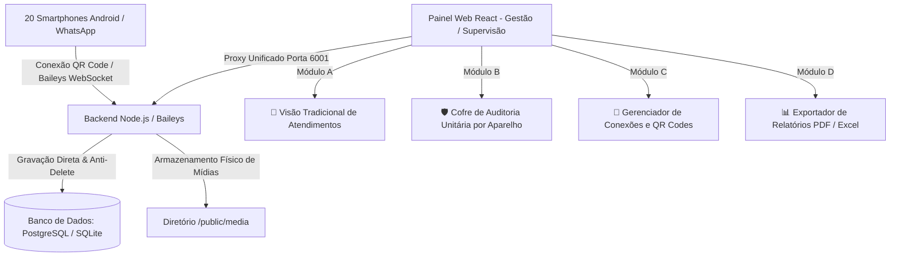

# 📋 PLANO COMPLETO DE ENGENHARIA — VERITAS
## Cofre & Auditoria WhatsApp — Substituto Enterprise do Digisac (Economia de R$ 36.000/ano)

---

## 🎯 1. Contexto & Justificativa do Projeto

* **Problema:** A plataforma atual (Digisac) cobra **R$ 3.000,00 mensais** para manter 20 celulares conectados, onerando a operação corporativa apenas para armazenamento e histórico de mensagens.
* **Solução:** Implementação de um **Cofre Autônomo de Auditoria e Backup Perpétuo de WhatsApp**, operando com o motor moderno **Baileys (WebSockets Puros)** hospedado em uma VPS da Hostinger com custo estimado de **~R$ 40,00 mensais**.
* **Economia Anual Projetada:** **R$ 35.520,00 / ano**.

---

## 🔒 2. Princípios e Regras Críticas do Sistema

1. **Imutabilidade Absoluta de Identidade e Nomes de Aparelhos**:
   - O nome atribuído pelo usuário a cada smartphone/WhatsApp é **soberano, perpétuo e 100% imutável** por rotinas automáticas.
   - Proibição total de renomeações automáticas em lote ou resets de identificação.

2. **Modo "Auditor Silencioso / Passivo" (Sem Interrupções)**:
   - Os operadores atendem e conversam normalmente através dos smartphones físicos ou WhatsApp Web.
   - O sistema opera como uma **caixa preta de auditoria**: apenas escuta, baixa mídias e grava conversas sem enviar saudações indesejadas, sem chatbots e sem obrigar encerramento de tickets.

3. **Mecanismo Anti-Delete Absoluto (Compliance & Jurídico)**:
   - Mensagens de texto, áudios, fotos, documentos e vídeos apagados pelo cliente ou operador ("Apagar para todos") são mantidos **100% intactos e legíveis** no banco de dados e no disco.
   - Sinalização com badge visual vermelho de auditoria: `🚫 MENSAGEM APAGADA NO WHATSAPP (às HH:MM:SS)`.

4. **Sincronização Retroativa das Últimas 24 Horas**:
   - No pareamento via QR Code, o sistema intercepta o pacote `messaging-history.set` do Baileys (`syncFullHistory: true`) para sincronizar o histórico prévio do dia anterior.

---

## 🏗️ 3. Arquitetura Técnica de Alto Desempenho



### ⚡ Eficiência de Recursos: Baileys vs Puppeteer
| Métrica | Puppeteer / WWebJS (Antigo) | Baileys WebSockets (Nosso Motor) |
| :--- | :--- | :--- |
| **Arquitetura** | Abre 1 navegador Chrome por celular | Conexão socket direta e nativa |
| **RAM por Aparelho** | 300MB a 500MB | **~25MB a 30MB** |
| **RAM Total (20 Celulares)** | 8GB a 12GB (Pesado/Instável) | **~600MB (Ultraleve)** |
| **Custo de VPS Necessário** | VPS cara (16GB RAM) | **VPS Básica (2 vCPU / 4GB RAM)** |

---

## 🔍 4. Novo Módulo: "Cofre / Auditoria Unitária por Aparelho"

Diferente do modelo engessado de Helpdesk, este módulo oferece consulta direta e independente:

### A. Seletor de Aparelhos (20 WhatsApps)
* Menu superior com cards/dropdown com todos os celulares cadastrados:
  * `[ 📱 Celular 01 - Cobrança A ]`
  * `[ 📱 Celular 02 - Cobrança B ]`
  * `...`
  * `[ 📱 Celular 20 - Recepção ]`

### B. Lista Direta de Conversas do Celular Selecionado
* Listagem de todos os contatos que interagiram com aquele chip específico, sem depender de ticket aberto/fechado.

### C. Filtros Avançados de Auditoria & Busca
1. 🔎 **Busca Global por Termo:** Varre o histórico por palavras-chave (ex: *"PIX"*, *"acordo"*, *"comprovante"*, *"cancelamento"*, *"ameaça"*).
2. 📅 **Filtro por Intervalo de Datas:** Consultas por períodos específicos (ex: mensagens entre 01/08 e 15/08).
3. 🚫 **Filtro "Apenas Mensagens Apagadas":** Exibe exclusivamente mensagens que foram deletadas para auditoria rápida.
4. 🎙️ **Filtro por Tipo de Mídia:** Isolamento de áudios de voz, fotos de documentos ou comprovantes em PDF.

### D. Visualizador Contínuo & Exportação de Laudos
* Timeline completa com horário exato e identificação de quem enviou.
* Player de áudio embutido para ouvir mensagens de voz gravadas.
* Botão **"Exportar Conversa"** gerando laudo formatado em **PDF, Excel ou TXT** para fins jurídicos ou de compliance.

---

## 🛠️ 5. Especificação de Rotas e Endpoints de Auditoria

| Método | Endpoint | Descrição |
| :--- | :--- | :--- |
| `GET` | `/audit/devices` | Lista os 20 aparelhos com status de conexão e total de mensagens armazenadas |
| `GET` | `/audit/devices/:id/chats` | Lista todas as conversas do aparelho especificado com busca por nome/número |
| `GET` | `/audit/messages` | Retorna o histórico com filtros (`whatsappId`, `search`, `startDate`, `endDate`, `onlyDeleted`, `mediaType`) |
| `GET` | `/audit/export` | Gera arquivo de exportação (PDF/CSV) de uma conversa específica |

---

## 🌐 6. Topologia de Rede & Bypass de Isolamento Corporativo

* **Portas Isoladas:**
  * `6001`: Frontend + Proxy Reverso Integrado (Sem conflito com CRM/PM2 na porta 3000).
  * `6002`: Backend API + Engine Baileys.
* **Canais de Acesso:**
  1. **Acesso Local Direto:** `http://192.168.1.128:6001/` (Regras liberadas no Firewall do Windows).
  2. **Túnel Seguro (Cloudflare Tunnel Ativo):** `https://higher-farmer-offshore-tropical.trycloudflare.com` (Bypassa bloqueios de AP Isolation / Wi-Fi corporativo).

---

## 👥 7. Matriz de Usuários e Permissões Iniciais

| Usuário | Login | Senha | Perfil | Finalidade |
| :--- | :--- | :--- | :--- | :--- |
| **Yasmin** | `yasmin` | `Ope@2025` | Administrador | Supervisão e Auditoria Geral |
| **Arthur Hille** | `arthur.hille` | `Ope@2025` | Administrador | Gestão Técnica e Conexões |
| **Jana Juttel** | `jana.juttel` | `Jana@2025` | Administrador | Supervisão de Atendimento |
| **Admin Geral** | `admin@whaticket.com` | `admin` | Administrador | Manutenção Master |

---

## 🚀 8. Guia Completo de Deploy na VPS Hostinger

### 1. Especificações Recomendadas na Hostinger:
* **Plano:** Hostinger KVM 2 ou KVM 4 (2 a 4 vCPUs, 4GB a 8GB RAM, NVMe).
* **SO:** Ubuntu 22.04 LTS x64.
* **Custo Estimado:** R$ 35,00 a R$ 45,00 / mês.

### 2. Pacote de Deploy (Docker Compose):
* `docker-compose.yml` contendo:
  - `whaticket-backend` (Node.js + Baileys)
  - `whaticket-frontend` (React SPA)
  - `postgres` (Banco de dados relacional com índices otimizados para busca)
  - `caddy` ou `nginx` (Reverse proxy com SSL automático Let's Encrypt)

### 3. Rotina de Backup Automático Diário (Cofre Perpétuo):
* Script Cron diário às 03:00 da manhã:
  ```bash
  0 3 * * * /root/scripts/backup-whaticket.sh
  ```
* **Ações do Script:**
  1. Dump do banco de dados (`pg_dump`).
  2. Compactação da pasta de mídias (`tar -czf media-backup.tar.gz /public`).
  3. Upload seguro via Rclone para Google Drive / AWS S3 / Cloudflare R2.

---

## 📅 9. Cronograma de Execução e Status

| Fase | Ação | Status |
| :---: | :--- | :---: |
| **Fase 1** | Teste de conceito e validação do motor Anti-Delete Baileys | ✅ Concluído |
| **Fase 2** | Configuração do repositório oficial em `D:\whaticket` com SQLite | ✅ Concluído |
| **Fase 3** | Ajuste de portas (6001/6002), proxy reverso e liberação de rede | ✅ Concluído |
| **Fase 4** | Cadastro dos usuários supervisores com acesso total | ✅ Concluído |
| **Fase 5** | Implementação do Sync Retroativo de 24h (1 conversa por vez) | ✅ Concluído |
| **Fase 6** | Criação do Módulo Frontend/Backend "Cofre / Auditoria por Aparelho" | ✅ Concluído |
| **Fase 7** | Geração do pacote e Deploy na VPS Hostinger (IP: 187.77.243.224) | ✅ Concluído |
